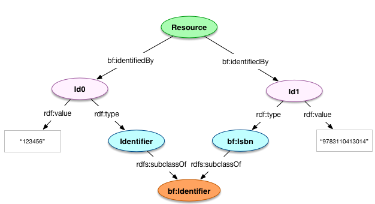

# Identifiers

## Introduction

The Identifier model is designed to support the inclusion of identifiers for resources used within the context of Hydra in a Box. This includes, but is not limited, to identifiers like LCCNs, ISBNS, and so forth, which may or may not have a URI form.

**NOTE:** This work could be aligned wih that underway by LD4P. 

## Model



### `bf:Identifier`

| Field             | Predicate    | Recommendation | Expected Value                            |
| ----------------- | ------------ | -------------- | ----------------------------------------- |
| *Identifier type* | `rdf:type`   | MUST           | `rdfs:Class`; subclass of `bf:Identifier` |
| *Value*           | `rdf:value`  | MUST           | Literal                                   |


### `rdfs:Class`

| Field             | Predicate                | Recommendation | Expected Value          |
| ----------------- | ------------------------ | -------------- | ----------------------- |
| *Subclass of*     | `rdfs:subClassOf`        | MUST           | `bf:Identifier` (class) |
| *Label*           | `rdfs:label`             | SHOULD         | Literal                 |
| *Note*            | `skos:note`              | SHOULD         | Literal                 |


### `rdf:Resource` (i.e. any Resource)

| Field             | Predicate         | Recommendation | Expected Value  |
| ----------------- | ----------------- | -------------- | --------------- |
| *Has identifier*  | `bf:identifiedBy` | MAY            | `bf:Identifier` |


### Usage

#### Defining New Identifiers and Identifier Classes

```turtle
<repo:/identifierTypes/FooLocalIdentifier> a rdfs:Class ;
    rdfs:subClassOf bf:Identifier ;
    skos:note "" ;
    rdfs:label "Used for identifying foo" .

<repo:/identifiers/id123> a <repo:/identifierTypes/FooLocalIdentifier> ;
    rdf:value "123" .

<repo:/identifiers/isbn/9783110413014> a bf:Isbn ;
  rdf:value "9783110413014" .
```

#### References to Identifiers

```turtle
<repo:/descriptions/object1> a bf:Work ;
  bf:identifiedBy <repo:/identifiers/id123>, <repo:/identifiers/isbn/9783110413014> .
```

### External Taxonomies

* LC's identifier classes
