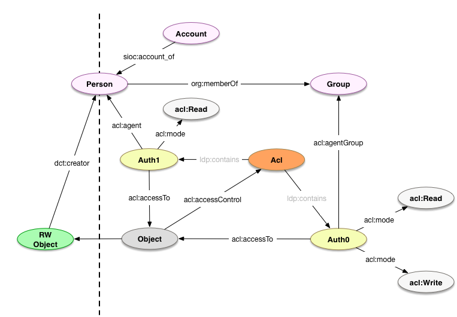

# Permissions

## Introduction

The permissions model represents the interaction between managed Resources and Agents' actions. 

## Use cases

* Access controls
    * Visibility levels: public, institution, private

**NOTES:**
* The following are open questions (or `TODO`s) about how to handle this in the model:
    * [ ] IP authentication/authorization
    * [ ] User-submitted workflow/mediated deposit (see [#49](https://github.com/hybox/models/issues/49))
    * [ ] Permission templates (see [#55](https://github.com/hybox/models/issues/55))

## Model



### [`foaf:Agent`](agents.md)

See [Agents](agents.md). 

### [`foaf:Account`](agents.md#accounts)

See [Accounts](agents.md#accounts). 

### `fedora:Resource`

| Field       | Predicate           | Recommendation | Expected Value                              |
| ----------- | ------------------- | -------------- | ------------------------------------------- |
| *has ACLs*  | `acl:accessControl` | MAY            | `fedora:Resource`, `webacl:Acl` (see notes) |

**NOTES:**

* The type of expected instances are Fedora-specific, and may be `fedora:Resource` or `webac:Acl` (see [comment on projecthydra/hydra-head#354](https://github.com/projecthydra/hydra-head/issues/354#issuecomment-221353696))

### `acl:Authorization`

| Field            |  Predicate               | Recommendation                                                | Expected Value    |
| ---------------- | ------------------------ | ------------------------------------------------------------- | ----------------- |
| *to*             | `acl:accessTo`           | SHOULD (unless `acl:accessToClass` provided)                  | `fedora:Resource` |
| *to all in*      | `acl:accessToClass`      | SHOULD (unless `acl:accessTo` provided)                       | `rdfs:Class`      |
| *agent*          | `acl:agent`              | SHOULD (unless `acl:agentGroup` or `acl:agentClass` provided) | `foaf:Agent`      |
| *agent class*    | `acl:agentClass`         | MAY (see <https://jira.duraspace.org/browse/FCREPO-2275>)     | `rdfs:Class`      |
| *agent group*    | `acl:agentGroup`         | SHOULD (unless `acl:agent` or `acl:agentClass` provided)      | `foaf:Group`      |
| *access mode*    | `acl:mode`               | SHOULD                                                        | `acl:Access`      |

## Usage

**NOTES:** 
* Access controls are defined using [WebAccessControl](https://www.w3.org/wiki/WebAccessControl).
* Fedora makes some specific assumptions about WebAccessControl.
    * See [WebAC Authorization Delegate](https://wiki.duraspace.org/display/FEDORA4x/WebAC+Authorization+Delegate) and its subpages for more detail.
    * Fedora only supports the following subclasses of `acl:Access`: `acl:Read` (includes `hyacl:Discover`) and `acl:Write`.
* IP-based authentication/authorization has not been addressed using this model yet. See [#52](https://github.com/hybox/models/issues/52).
* External groups are understood to be never important to the repository directly. If they are, then they need to be recreated within the scope of the repository, either automatically (through synchronization/mapping) or manually.

### Defining new permissions 

```turtle
</rest/acls> a fedora:Resource .

</rest/groups/group0> a foaf:Group ;
    foaf:member <http://example.org/staff#beatrice> .

</rest/acls/auth0> a fedora:Resource, acl:Authorization ;
    acl:accessToClass fedora:Resource ;
    acl:mode acl:Read, hyacl:Discover ;
    acl:agent <http://example.com/people#alice> .

</rest/acls/auth1> a fedora:Resource, acl:Authorization ;
    acl:accessToClass fedora:Resource ;
    acl:mode acl:Read, acl:Write, hyacl:Discover ;
    acl:agentGroup </rest/groups/group0> .
```

### References to permissions

```turtle
</rest/some/object> a fedora:Resource, pcdm:Object ;
    acl:accessControl </rest/acls> .
```