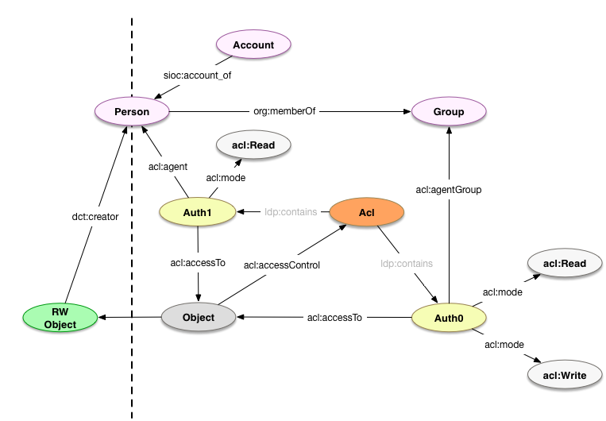

## Permissions

### Introduction

The permissions model represents the interaction between managed Resources and Agents' actions. Agents represent real entities and have associated Accounts used for authentication.

### Notes on implementation

* Accounts are included in the model for completeness, but there is no assumption that they will be implemented as repository objects. Accounts may be managed in a separate database or application.
* Access controls are defined using [WebAccessControl](https://www.w3.org/wiki/WebAccessControl).
* Fedora makes some specific assumptions about WebAccessControl. See [WebAC Authorization Delegate](https://wiki.duraspace.org/display/FEDORA4x/WebAC+Authorization+Delegate) and its subpages for more detail.
* IP-based authentication/authorization has not been addressed using this model yet. See [#52](https://github.com/hybox/models/issues/52).
* External groups are understood to be never important to the repository directly. If they are, then they need to be recreated within the scope of the repository, either automatically (through synchronization/mapping) or manually.

### Model

* `foaf:Agent` (see [agents](agents.md))
  * Note: An Agent may be both identified in an authentication/authorization context and referenced in descriptive metadata (e.g. as `dcterms:creator`). We make no distinction between these types of Agents.

* `foaf:Account`
  * `sioc:account_of` (MUST; see [#30](https://github.com/hybox/models/issues/30))
  * `foaf:accountName` (MUST)
  * `rdfs:label` (SHOULD)

* `fedora:Resource` or `webac:Acl` (see [comment on projecthydra/hydra-head#354](https://github.com/projecthydra/hydra-head/issues/354#issuecomment-221353696))
  * `acl:accessControl` (MAY)

* `acl:Authorization`
  * `acl:accessTo` (SHOULD, unless `acl:accessToClass` present)
  * `acl:accessToClass` (SHOULD, unless `acl:accessToClass` present)
  * `acl:agent` (SHOULD, unless `acl:agentGroup` present)
  * `acl:agentGroup` (SHOULD, unless `acl:agent` present; see [FCREPO-2275](https://jira.duraspace.org/browse/FCREPO-2275))
  * `acl:agentClass` (MAY?; see [FCREPO-2275](https://jira.duraspace.org/browse/FCREPO-2275))
  * `acl:mode` (MUST be one of `acl:Read`, `acl:Write`, `hyacl:Discover`)



### Usage

#### Defining new permissions 

```turtle
</rest/acls> a fedora:Resource .

</rest/groups/group0> a foaf:Group ;
    foaf:member <http://example.org/staff#beatrice> .

</rest/acls/auth0> a fedora:Resource, acl:Authorization ;
    acl:accessToClass fedora:Resource ;
    acl:mode acl:Read, hyacl:Discover ;
    acl:agent <http://example.com/people#alice> .

</rest/acls/auth1> a fedora:Resource, acl:Authorization ;
    acl:accessToClass fedora:Resource ;
    acl:mode acl:Read, acl:Write, hyacl:Discover ;
    acl:agentGroup </rest/groups/group0> .
```

#### References to permissions

```turtle
</rest/some/object> a fedora:Resource, pcdm:Object ;
    acl:accessControl </rest/acls> .
```