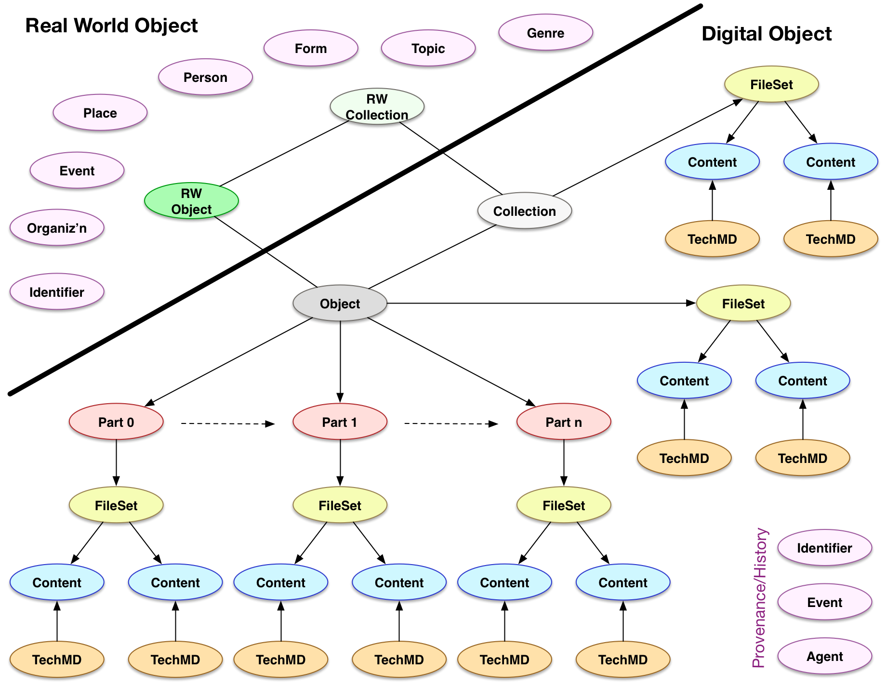

## Design Principles for Data Modeling in HyBox

### Use discovery and search requirements as a pragmatic means to determine the needed extent of the modeling efforts

For example, physical description of a postcard is intended only to be recorded and displayed to the user and is not intended to be interoperable in terms of description across objects.  Given the above principle, the physical description can be a simple string with arbitrary content, understandable to the human end-user but not to a machine for comparison.

```json
{"dc:extent": "3x4 inches"}
```

is thus acceptable compared to the more complex

```json 
{
  "height": {"value": 3, "units": "in"},
  "width": {"value": 4, "units": "in"}
}
```

### Clear separation of Real World and Digital Objects allows easy replacement in different contexts

While it takes slightly more implementation effort, and there is a performance impact of creating and managing more objects in the persistence system, the value of keeping the digital object's identity separate from the real world object's identity enables and promotes later extensions and revisions.  It is not possible for any one system to _a priori_ have models for all possible content types, especially as there are already multiple ontologies and descriptive systems in use within every community.  With a clearly described set of expectations (an API) for what information is required about the RWO, the linked data model and persistence layer can be changed out to accomodate these new, emerging requirements.

Separation of the two allows for interesting use cases to be handled consistently, where they might prove challenging without the separation.  For example, if the back of a photograph has some writing on it, but is not digitized, then without the separation of Object and FileSet, there would be no resource to maintain an in-model transcription or description of the writing.  It also allows for one Object to have multiple FileSets, rather than merging them together or requiring that FileSets also have FileSets.

While the HyBox platform needs to have descriptive metadata capabilities, this pattern intentionally limits the scope of initial modeling efforts without restricting future additions.

```json
{
    "id": "http://example.repo/id/1",
	"type": "Work",
	"label": "Manuscript M640",
    "etc": "etc",
    "hasDigitalRepresentation": {
        "id": "http://example.repo/id/2",
        "type": "pcdm:Object",
        "hasMember": [ {}, {}, {} ]
    }
}
```

### People, places, and their relationships are critical features

Beyond the core repository functions of managing digital content and its structure, People and Places were identified as critical for search and discovery.  Additionally, they provide understandable, real world anchors on which to pivot to demonstrate the value of Linked Data as the core framework, rather than just another record format.  As such, they will require models and the identification of a core set of relationships with the real world objects.  Thus People and Places will be managed as entities within the system, rather than as strings in a record, and linked to from other resources.

The MARC relators vocabulary has been identified as a potential source of interesting relationships to be explored.

```json
{
	"id": "http://example.repo/id/1",
	"type": "Work",
	"marcrel:aut": {
		"id": "http://example.repo/people/8",
		"name": {"fr": "Jehan Froissart"}
	}
}
```

### RWO Events are not in scope for the first phase

Archival and Museum objects are often described in terms of events within their life cycle, especially to track ownership and exhibition history. An event is seen as an activity or action that has actors, and occurs at a certain time and place.  For example, the artist paints a portrait of the sitter in Paris in 1704.  Management of events as resources is not seen as being in scope for the first phase of HyBox work, however following the separation of real world and digital objects, there should be scope for interested parties to extend the model with information of this sort.

On the other hand, repository level events are seen as being in scope for the work to track the versioning of a resource, its audit trail and so forth.  Development work in this area should keep the above in mind and consider whether it is possible to handle both types of event with one set of code.


### Identifiers are Resources

Unlike the vanilla `dc:identifier` string, we consider that identifiers are full resources that can have relationships and properties.  In particular, identifiers have a type (e.g. CODEN, ISSN, DOI, Handle, LCCN, Dewey, ...)  which may be only of local significance, and a value.  They can also be deprecated or replaced.  They can be associated with both real world objects, or with digital objects.

```json
{
	"id": "http://example.repo/id/1",
	"type": "Work",
    "identifiedBy": {
      "type": "ISBN",
      "value": ""
    }
}
```

### The Repository cares about derivatives

While some file formats can be easily managed as a single resource with derivatives automatically generated and cached for performance, there are also many other formats where this is not possible.  Audio and Video transcoding is not universally understood, and there may be custom settings applied to individual objects to obtain the best results.

Secondly, derivatives may include representations that involve human interaction, creativity and decision making.  These outputs of activity need to be preserved as they cannot be automatically recreated.  Examples include the cropping of page images to remove the scanning bed, the generation of filmstrip thumbnail images to represent a video, or simply the selection of the most interesting part of the most appropriate representative image from a manuscript.  This implies that the depositor or curator can select this representative part, rather than it being automatically determined by the system.

The relationship between master and derivative should be maintained in the repository, and these files and relationships should be able to be bulk imported.


### Access UX is outside of the scope of the model

The ways in which an object can and should be displayed will be determined by the properties of the object rather than explicitly recorded as part of the object.  For example, a sequence of images does not require the depositor to decide that the images (in TIFF) should be transformed into Jpeg2000, nor that the system should present them in a pan/zoom gallery. Instead, the property that records the sequence of images are just individuals in an order, rather than pages of a book, plus their resolution and access restrictions can be used to determine how best to render the content to the user.

This means that the user does not need to select a user experience pattern up front, for which they may not have sufficient information to make a sensible choice.  The user also does not need to know the internal workings of the system, to say that their images should be transcoded. It further means that, as the model does not need to capture such decisions, there does not need to be remediation of those decisions when UI/UX expectations and implementations change.  Technology changes much faster than data, and we need to plan responsibly for future enhancements.

### Collection information is important

Different features for collections include dates and places of exhibition, provenance information, and so forth.  Many of the features of objects will be useful, and the exact nature of collection description needs to be discussed and decided upon.


## High Level Model Sketch


