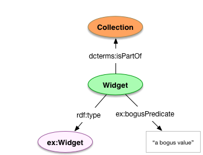

# Model template

This is a Markdown template for sample model documentation as used by the Hydra in a Box models repository.

**NOTES:**
* The key words "MUST", "MUST NOT", "REQUIRED", "SHALL", "SHALL NOT", "SHOULD", "SHOULD NOT", "RECOMMENDED", "MAY", and "OPTIONAL" in this document are to be interpreted as described in [RFC 2119](https://www.ietf.org/rfc/rfc2119.txt).
* All model documentation MUST comply with Github-flavored Markdown.
* All sections MAY have one or more notes associated with them, indicated by the phrase `**NOTES:**` followed by a Markdown list.
* Code-fenced blocks for Turtle MUST NOT be indented, regardless how the examples appear below.
* All model documents MAY include Jekyll YAML frontmatter at the top. If including YAML frontmatter, it is RECOMMENDED to include a `model` key with a YAML mapping containing `organization` and `project` keys. The `model` key MAY have a `namespaces` key, which contains a mapping associating namespace prefixes with their base URIs.

Example:

```markdown
---
title: Widgets
author: Ben Marcata
date: 2016-10-19 17:46:49 -05:00
model:
    organization: Marcata Widgets Pty Ltd
    project: Pacifica Common Doodad Markup
    namespaces:
        ex: http://example.org/pcdm/models#
---
```

# Model name

The shorthand, natural language noun used to define to identify the model

**NOTES:**
* All model documents MUST have a model name.
* All model names SHOULD be in a plural form (e.g., prefer `Books` over `Book`)

Example:

```markdown
# Widgets
```

## Introduction 

Include here an overview of the intent of the model. If there is detailed information on use cases, push that to a separate "Use Cases" section.

**NOTES:** 
* All model documents MUST have an introduction.

Example:

```markdown
## Introduction

This model describes the use of Widgets, the class of objects that includes
jawns, thingamabobs, doodads, and sprockets.

**NOTES:**

* Widgets SHOULD NOT be used to model Frippery. 
```

## Use Cases

An itemized grouping or list of use cases that the model is intended to support. 

**NOTES**:

* When adding detailed use cases, provide subheadings for each use case.

Example:

```markdown
## Use Cases

* Documenting gadgets around your repository, and how Agents use them.
* The Internet of Things
```

## Model

Documentation on the properties and classes used in the model.

**NOTES**: 
* The documentation SHOULD include a drawing of the model.
* The documentation MUST include an itemized list of the most relevant classes to the model.

### Identified classes and properties

All relevant classes and properties should appear as subsections under the Model section.

**NOTES:** 
* If a given documented class is a subclass of another documented class, it SHOULD be identified as such. 
* The documentation MUST include an itemized list of properties defined as MUST and SHOULD for instances of the identified classes. The documentation MAY include properties defined as MAY for those instances. Documentation for a subclass of a given class MAY skip including property definitions unless their recommendation varies from the subclass's superclass.
* If a class definition defines a new class, the documentation for that class MAY include a brief example implementation. If an implementation is provided, it MUST be provided in Turtle.
* The documentation for a given class MAY include any entailment information for additional context based on the use of specific predicates associated with an instance of that class. 
* If the expected type value is given, a class identifier MUST be understood as referencing an instance of the class. If that referenced class is documented in the model, its name should be linked to the relevant model document. 
* If the expected type value of a given predicate is a class itself, it MUST be identified using the text `(class)`.

Example:

```markdown
## Model

### `ex:Widget`

Entailment with `owl:Thing` (from `ex:bogusPredicate`). 

    ```turtle
    ex:Widget a rdfs:Class ; 
        owl:equivalentClass <http://purl.org/NET/raul#Widget> . 
    ```


| Field            | Predicate                | Recommendation | Expected Value                    |
| ---------------- | ------------------------ | -------------- | --------------------------------- |
| *bogosity*       | `ex:bogusPredicate`      | MUST           | Literal                           |
| *part of*        | `dcterms:isPartOf`       | SHOULD         | [`dcmitype:Collection`](colls.md) |
| *label*          | `rdfs:label`             | MAY            | Literal                           |
| *type*           | `rdf:type`               | MAY            | `ex:Widget` (class)               |

### `ex:Gadget < ex:Widget`

| Field            | Predicate                | Recommendation | Expected Value        |
| ---------------- | ------------------------ | -------------- | --------------------- |
| *part of*        | `dcterms:isPartOf`       | SHOULD NOT     |                       |
| *label*          | `rdfs:label`             | SHOULD         | Literal               |
```

## Usage

Include here documentation of how to use instances of the model, such as defining new instances, subclasses, etc., and how to refer to instances. 

**NOTES:**
* The Usage section MUST contain a subsection on defining instances. Within that subsection, information on how to define new subclasses of that model SHOULD be provided if subclasses can be defined. 
* The Usage section SHOULD contain a subsection on referring to instances from instances of other classes in a related model. The subsection MAY included links to other documentation for other models if appropriate. 
* Regardless of type, all examples MUST be provided as Turtle. The code-fenced blocks for Turtle MUST NOT be indented, regardless how the examples appear below.

Example:

```markdown
## Usage

### Defining new Widgets and new Widget Classes 

    ```turtle
    <repo:/widgets/widget0> a ex:Widget ;
        ex:bogusPredicate "f00f" ;
        dcterms:isPartOf <repo:/collections/coll0> .

    <repo:/ns/MyWidget> a rdfs:Class ;
        rdfs:label "My Widget"@en ;
        rdfs:subclassOf ex:Widget.
    ```

### References to Widgets

    ```turtle
    <repo:/cars/car0> a ex:Vehicle ;
        ex:hasWidget <repo:/widgets/widget0> . 
    ```
```

# Full example (without YAML frontmatter)

* * *

# Widgets

## Introduction

This model describes the use of Widgets, the class of objects that includes
jawns, thingamabobs, doodads, and sprockets.

**NOTES:**

* Widgets SHOULD NOT be used to model Frippery. 

## Use Cases

* Documenting gadgets around your repository, and how Agents use them.
* The Internet of Things

## Model



### `ex:Widget`

Entailment with `owl:Thing` (from `ex:bogusPredicate`). 

```turtle
ex:Widget a rdfs:Class ; 
    owl:equivalentClass <http://purl.org/NET/raul#Widget> . 
```

| Field            | Predicate                | Recommendation | Expected Value                    |
| ---------------- | ------------------------ | -------------- | ---------------------             |
| *bogosity*       | `ex:bogusPredicate`      | MUST           | Literal                           |
| *part of*        | `dcterms:isPartOf`       | SHOULD         | [`dcmitype:Collection`](colls.md) |
| *label*          | `rdfs:label`             | MAY            | Literal                           |
| *type*           | `rdf:type`               | MAY            | `ex:Widget` (class)               |

### `ex:Gadget < ex:Widget`

| Field            | Predicate                | Recommendation | Expected Value        |
| ---------------- | ------------------------ | -------------- | --------------------- |
| *part of*        | `dcterms:isPartOf`       | SHOULD NOT     |                       |
| *label*          | `rdfs:label`             | SHOULD         | Literal               |

## Usage

### Defining new Widgets and new Widget Classes 

```turtle
<repo:/widgets/widget0> a ex:Widget ;
    ex:bogusPredicate "f00f" ;
    dcterms:isPartOf <repo:/collections/coll0> .

<repo:/ns/MyWidget> a rdfs:Class ;
    rdfs:label "My Widget"@en ;
    rdfs:subclassOf ex:Widget.
```

### References to Widgets

```turtle
<repo:/cars/car0> a ex:Vehicle ;
    ex:hasWidget <repo:/widgets/widget0> . 
```